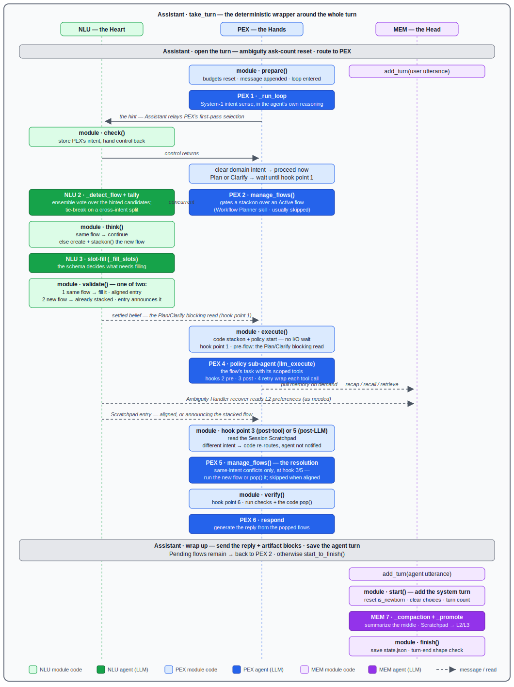

# The Canonical Turn

The full turn as contracted in round 3.4 (`_specs/_review/rounds/round_3.4_spec.md`), drawn in
sequence-diagram style: the Assistant's `take_turn` is the frame around the whole turn, and the
three modules — [NLU](nlu.md) (Heart), [PEX](pex.md) (Hands), [MEM](mem.md) (Head) —
are peer lifelines inside it, with time flowing down.

Hue marks the module (green NLU, blue PEX, purple MEM, gray Assistant); saturated boxes are async
agent (LLM) moves, light boxes are synchronous module code. Solid arrows are control transfers;
dashed arrows are messages and reads. The two dashed arrows into MEM are not part of the canonical
sequence — they show the peer-level interactions that occur when a policy pulls memory on demand
or the Ambiguity Handler's recover path reads L2 preferences.

The diagram is a hand-written SVG (`canonical_turn.svg`, same directory) — edit the text elements
directly to keep it in sync with the spec.

